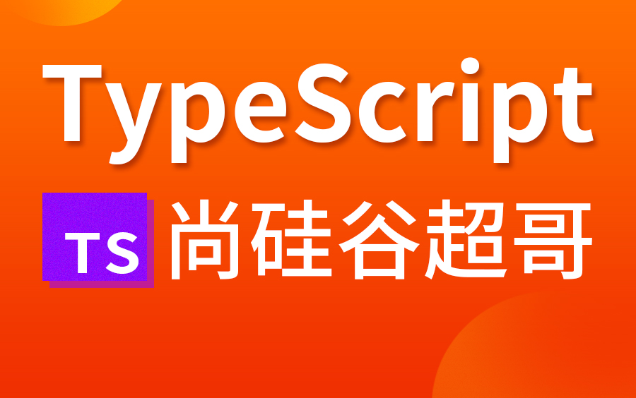
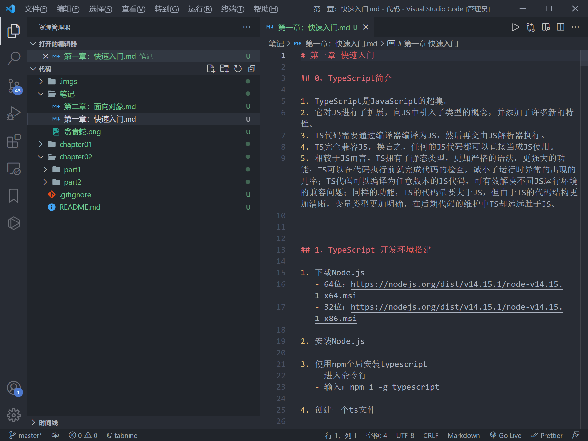
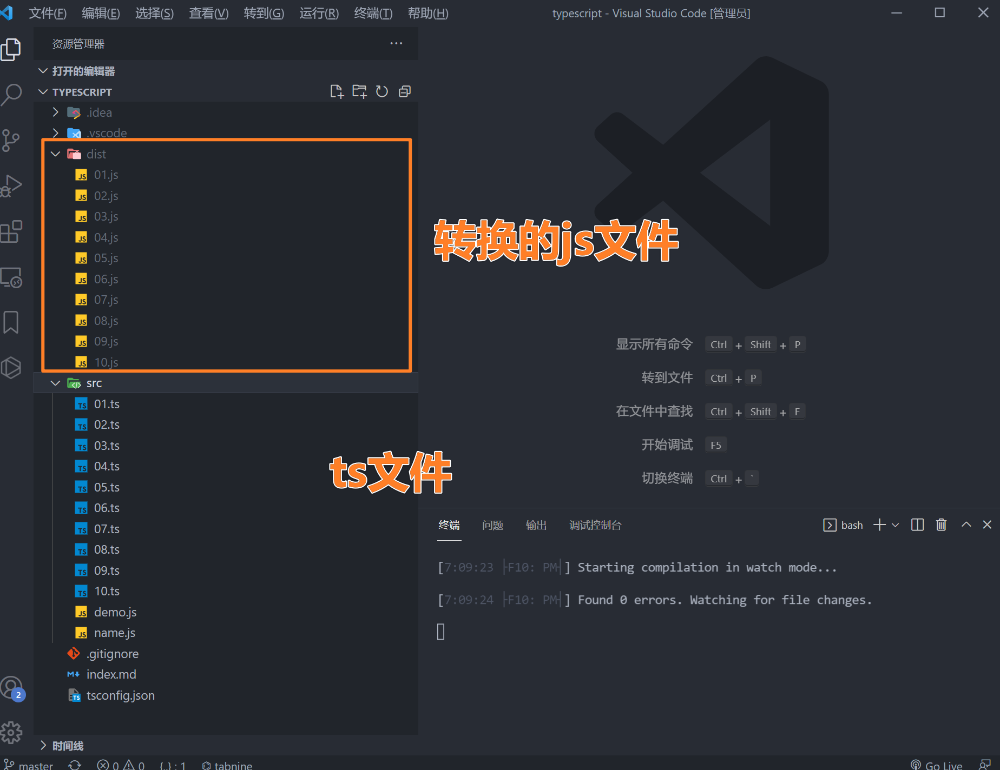
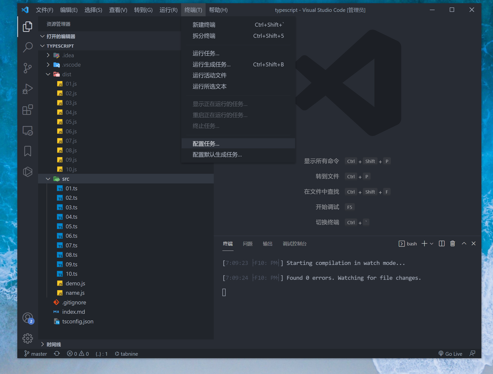
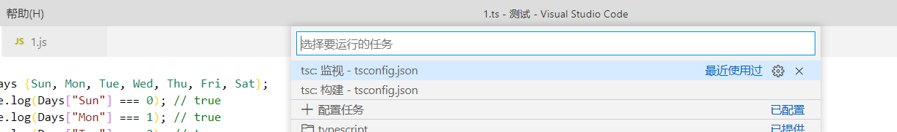

# TS学习笔记

## 在线视频地址:

[视频资源](https://www.bilibili.com/video/BV1Xy4y1v7S2?p=1)



## 文件目录结构:

配套笔记在笔记目录



## 2.环境搭建


### 全局安装typescript

```shell
npm  install -g typescript
npm install --save -g @types/node

```

输入指令:`npm update -g typescript`
查看版本指令`tsc -v`


### 安装ts-node

```shell
npm install -g ts-node 
```

### 创建tsconfig.json

-  typescript 的项目都需要一个tsconfig.json
   输入命令`tsc --init`会创建一个这样内容的tsconfig.json


```json
{
  "compilerOptions": {
    "module": "commonjs",
    "target": "es6",
    "removeComments": false,
    "noImplicitAny": false,
    "sourceMap": true,
    "allowJs": true
  },
  "exclude": ["node_modules"]
}
```

因为写`node.js`你可以修改`target`为`es6`, 要调试把 `sourceMap`改为`true`, 添加`allowjs`为`true`,就可以ts和js混合用了.

## vscode自定编译ts

打开终端 输入

```
tsc -w
```



或者配置任务.自定

参照:

然后我们需要点击终端，选择监视



这时候终端里面就会出现



你每次进行更改保存代码的时候，都会自己保存，同步生成js对应的文件。

```tip
注意：这个终端需要是默认的,必须为powershell

我之前把我终端改成bash，就一直无法监视成功！
```

